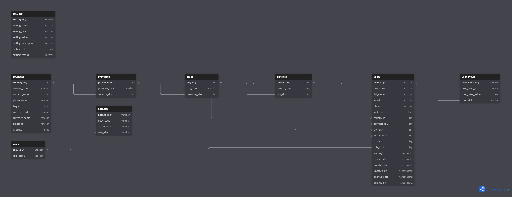

# 🚀 Template Backend Project - .NET Core + MySQL & PostgreSQL

## 📖 Deskripsi
Project ini adalah backend API yang dibangun dengan **C# & .NET Core**, menggunakan **PostgreSQL** sebagai database. API ini menyediakan berbagai endpoint untuk mengelola data yang tersimpan dalam sistem.

---

## 📌 Teknologi yang Digunakan
- **Bahasa Pemrograman**: C#  
- **Framework**: .NET Core  
- **Database**: PostgreSQL  
- **ORM**: Entity Framework Core  
- **Dependency Injection**: .NET Core Built-in DI  
- **Logging**: Serilog  
- **Dokumentasi API**: Swagger (OpenAPI)  

---

# Status: [Onprogress]

<!-- ## 🏛️ **Desain Database**
Berikut adalah struktur database yang digunakan dalam proyek ini:

### 🔹 **Diagram Database**
 -->

<!-- > **📌 Catatan:** File diagram ini tersedia di folder `docs/database_design.png`.  
> Untuk mengeditnya, gunakan [dbdiagram.io](https://dbdiagram.io/). -->

---

<!-- ## ⚙️ **Instalasi & Konfigurasi**
### 1️⃣ **Clone Repository**
```sh
git clone https://github.com/username/backend-project.git
cd backend-project -->